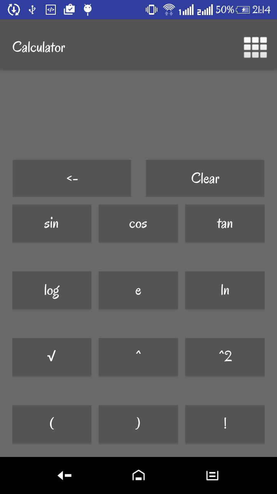
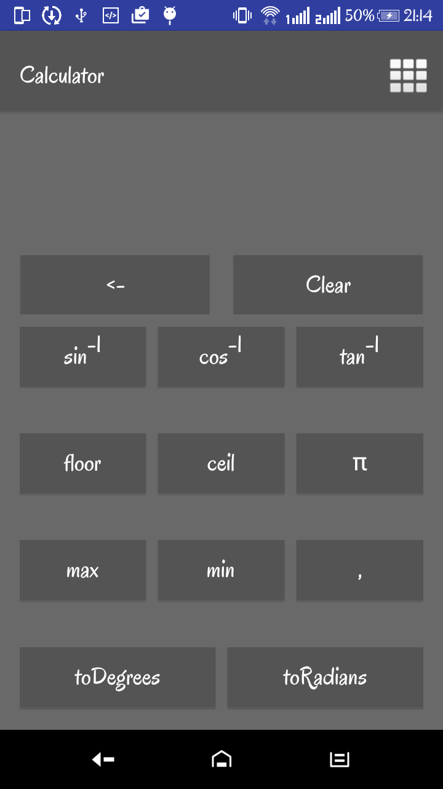
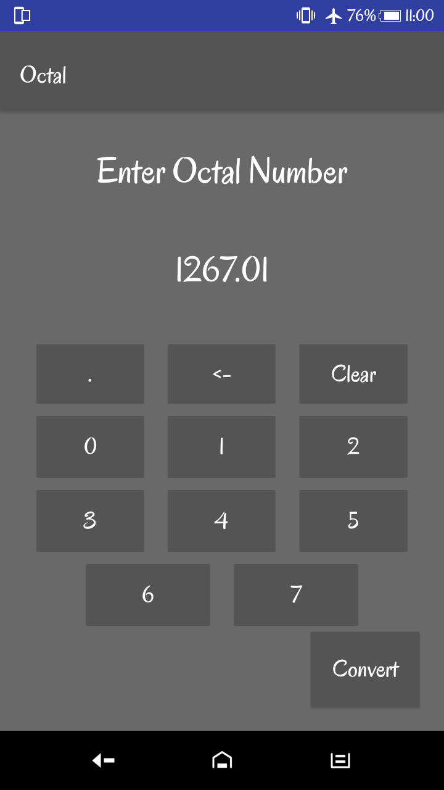
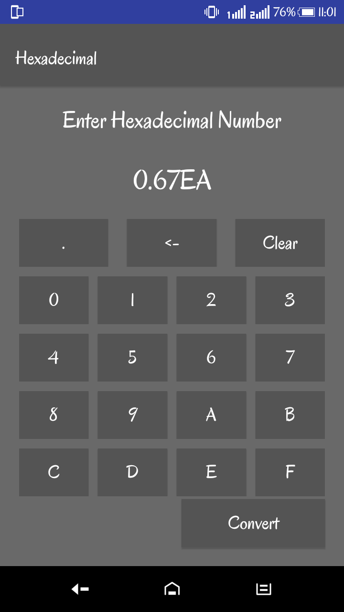

# Scientific Calculator
Got struck with a heavy calculation or can't just hang your mind with maths? Here's an android app for you, with not only having some basic features or advanced features of scientific calculator but also number conversion system

###Functionalities:
<ul>
<li><h4> scientific notation</h4></li>
<li><h4> floating point arithmetic</h4></li>
<li><h4> logarithmic functions, using both base 10 and base e</h4></li>
<li><h4> trigonometric functions</h4></li>
<li><h4> exponential functions and roots beyond the square root</h4></li>
<li><h4> quick access to constants such as pi and e</h4></li>
<li><h4> Number conversion system</h4></li>
</ul>
 
 
###Screenshots:

  
  
  

  
  
  

  
  
  

### Passed Testcases:
* 1 + 2 = 3
* 1.1 + 2.2 = 3.3
* 2.2 -1.1 = 1.1
* 2 * 3 = 6.0
* 3 / 4 = 0.75
* 3 + 2 - 1 = 4
* sin30 = -0.988
* sin30*4 = -3.952
* cos30 = 0.1542
* sin(21+9) = -0.988
* log(10+90) = 2
* log(log(100+900)) = 0.477
* sinsin30*4 = -3.33977
* -3*2 = -6
* -3*(-2) = 6
* 3*(-2) = -6
* -3-2 = -5
* 2*e = 5.43656365
* 2*pi = 6.2856
* 2^2 = 4
* 16^2 = 256
* 1.4^2 = 1.95999
* (3+2)^2 = 25
* 3! = 6
* (3+2)! = 120
* max(3,(1+1)) = 3.0
* min((1+1),3) = 2.0
* max(3,(2*(1+1))) = 4.0

####Future Feature Inclusions:
* cursor controls to edit equations and view previous calculations
* hexadecimal, binary, and octal calculations, including basic Boolean math
* complex numbers
* fractions calculations
* statistics and probability calculations
* programmability
* equation solving
* matrix calculations
* calculus
* letters that can be used for spelling words or including variables into an equation
* conversion of units
* physical constants
